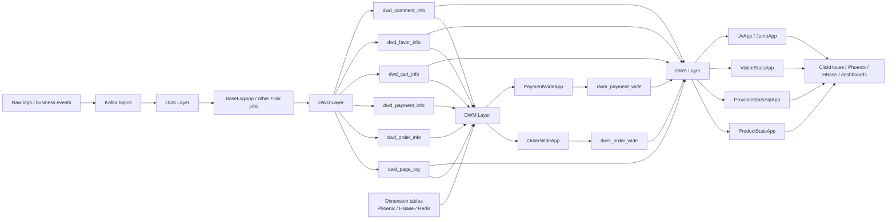

# Flink Commerce Project

A Java-based real-time e-commerce data pipeline built with Apache Flink. This project demonstrates how to ingest event logs and business data from Kafka, perform streaming transformations, enrich dimensions, aggregate metrics, and write results to downstream storage systems such as Kafka, HBase/Phoenix, and ClickHouse.

The codebase follows a typical data warehouse and real-time analytics architecture for an online retail business.

## Overview

This project is designed around the following flow:

- Data collection from user behavior and business events
- Kafka as the event bus
- Flink jobs to clean, split, join, and aggregate streaming data
- Dimension and fact processing for orders, payments, product stats, visitor stats, etc.
- Output to analytical storage and downstream consumers

In short, it is a real-time data warehouse / business intelligence project for a shopping platform.

## Main features

- Base log parsing and user behavior analysis
- New vs returning customer recognition
- Page, click, display, action, and cart event splitting
- Order and payment wide-table processing
- Product-level metrics aggregation
- Province-level and visitor-level real-time statistics
- Integration with Kafka, Redis, MySQL, Phoenix, and ClickHouse

## Tech stack

- Java 8
- Apache Flink 1.12.0
- Kafka
- Hadoop / HDFS
- HBase / Phoenix
- ClickHouse
- Redis
- MySQL
- Maven

## Project structure

```text
commerce_flink_java/
├── src/
│   └── main/
│       ├── java/com/atguigu/gmall/realtime/
│       │   ├── app/
│       │   │   ├── dwd/
│       │   │   ├── dwm/
│       │   │   └── dws/
│       │   ├── bean/
│       │   ├── common/
│       │   └── utils/
│       └── resources/
│           └── log4j.properties
├── input/
│   └── article.txt
├── pom.xml
├── .gitignore
└── README.md
```

### Key packages

- `app.dwd`: basic dimension/raw log processing jobs
- `app.dwm`: derived wide-table and intermediate state jobs
- `app.dws`: daily summary and statistics jobs
- `bean`: domain objects such as order, payment, product, and visitor statistics
- `utils`: Kafka, HBase/Phoenix, ClickHouse, Redis, and timing helpers
- `common`: shared configuration and constants

## Core job examples

The project includes several Flink apps that act as streaming pipelines:

- `BaseLogApp`: parses ODS log data, detects new users, splits log events into page/start/display/action channels, and writes to Kafka topics
- `OrderWideApp`: enriches order data into a wider fact structure
- `PaymentWideApp`: aggregates payment-related business data
- `ProductStatsApp`: calculates product-level metrics such as clicks, favorites, carts, orders, payments, refunds, and comments
- `ProvinceStatsSqlApp`: province-based aggregated statistics with SQL/Table API style processing
- `VisitorStatsApp`: visitor metrics and session-style analytics
- `UvApp`: unique visitor calculation
- `JumpApp`: page jump or bounce detection logic

## Configuration

The project contains environment-specific settings in `common/GmallConfig.java`.

Important items to check before running locally:

- Kafka broker addresses
- HDFS/HBase/Phoenix connection strings
- ClickHouse JDBC URL
- Redis, MySQL, and cluster hostnames

The current configuration is hardcoded to a Hadoop cluster naming pattern such as:

- Phoenix: `jdbc:phoenix:hdp101,hdp102,hdp103:2181`
- ClickHouse: `jdbc:clickhouse://hdp102:8123/gmall_flink`

These values are environment-specific and should be updated to match your own deployment.

## Build

From the project root:

```bash
mvn clean package -DskipTests
```

This generates a fat JAR with dependencies using the Maven Assembly plugin.

## Run a job

After building, run a specific Flink job from the generated JAR:

```bash
java -cp target/commerce_flink_java-1.0-SNAPSHOT-jar-with-dependencies.jar \
  com.atguigu.gmall.realtime.app.dwd.BaseLogApp
```

You can replace the class name with any of the streaming apps in `src/main/java/com/atguigu/gmall/realtime/app`.

If you are developing in IntelliJ IDEA, you can also run each `main` method directly from the IDE.

## Typical execution flow

1. Produce raw log or business events into Kafka.
2. Start one or more Flink jobs from the `app` package.
3. The job reads Kafka topics, applies transformations, and emits intermediate topics.
4. Downstream jobs consume those topics for business-level metrics.
5. Results are written to analytical storage and dashboards.

## Data flow architecture

This project follows a classic layered streaming pipeline based on the ODS -> DWD -> DWM -> DWS model used in real-time data warehousing.



### 1) ODS layer: raw log ingestion

The first job, `BaseLogApp`, reads raw log events from the `ods_base_log` Kafka topic.

- The stream is filtered and parsed into JSON objects.
- Each user session is identified by `mid` (member ID / device ID).
- A stateful `ValueState` tracks the last visit date to decide whether a user is a new or returning visitor.
- Events are routed into multiple side outputs:
  - `dwd_start_log`
  - `dwd_page_log`
  - `dwd_displays_log`
  - `dwd_actions_log`

This split sets up a clean DWD layer for downstream business analysis.

### 2) DWD layer: event-level fact data

The DWD jobs consume the split raw events and produce more structured fact topics such as:

- `dwd_page_log`
- `dwd_order_info`
- `dwd_detail_info`
- `dwd_payment_info`
- `dwd_order_refund_info`
- `dwd_comment_info`
- `dwd_cart_info`
- `dwd_favor_info`

These topics contain event-level records for user behavior and business actions, each normalized for later aggregation.

### 3) DWM layer: wide-table enrichment and association

Intermediate jobs join fact tables with related dimensions or combine multiple event streams into business-level “wide tables”.

- `OrderWideApp`
  - Reads `dwd_order_info` and `dwd_detail_info`
  - Joins order header and order detail by `order_id`
  - Enriches data with province, SKU, and user attributes from Phoenix/HBase dimension tables
  - Writes the result to Kafka topic `dwm_order_wide`

- `PaymentWideApp`
  - Reads `dwd_payment_info` and `dwm_order_wide`
  - Uses interval join to match order payment events with the corresponding order records
  - Produces `dwm_payment_wide`

These wide tables reduce repeated dimension lookups in later metrics jobs and make business analytics easier.

### 4) DWS layer: metrics aggregation

The aggregate jobs consume the DWM-wide data and produce business statistics such as:

- product stats (`ProductStatsApp`)
- province stats (`ProvinceStatsSqlApp`)
- visitor stats (`VisitorStatsApp`)
- UV (unique visitor) stats (`UvApp`)
- page jump analysis (`JumpApp`)

Example: `ProductStatsApp` reads product-related topics like:

- `dwd_page_log`
- `dwd_favor_info`
- `dwd_cart_info`
- `dwm_order_wide`
- `dwm_payment_wide`
- `dwd_order_refund_info`
- `dwd_comment_info`

It aggregates metrics such as:

- display count
- click count
- favorite count
- cart count
- order quantity
- order amount
- payment amount
- refunded order count
- refund amount
- comment count
- good comment count

These stats are then stored in downstream analytical systems like ClickHouse.

### 5) Output storage

The project writes results to several backend systems depending on use case:

- Kafka topics for intermediate stream data
- HBase/Phoenix for dimension tables and reference data
- ClickHouse for analytical reporting and summary tables
- Redis / MySQL for auxiliary data access where needed

### End-to-end example

A typical flow in this project looks like this:

`User page click / order / payment events -> Kafka -> BaseLogApp / DWD jobs -> OrderWideApp / PaymentWideApp -> ProductStatsApp / ProvinceStatsSqlApp -> ClickHouse / analytical reports`

This means the pipeline continuously transforms raw user activities into actionable business metrics in near real time.

## Notes

- This project is intended for learning and demonstration.
- The configuration is tightly coupled to a cluster environment and will need adjustment for local development.
- Checkpointing is enabled and state backends are configured for HDFS-based streaming recovery.

## License

This repository does not include a dedicated license file. Please check the project owner or upstream source before using it in production environments.
